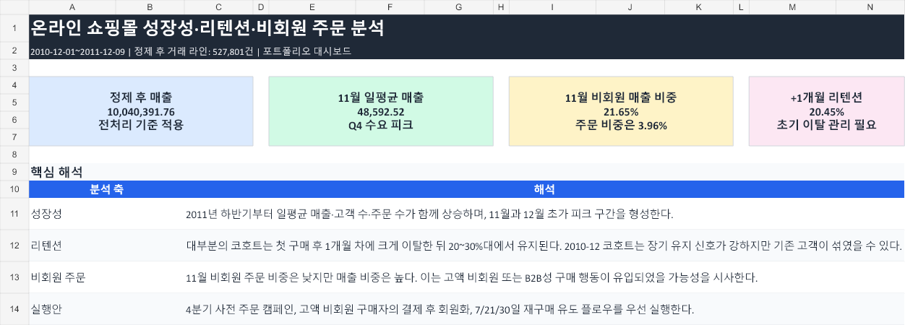
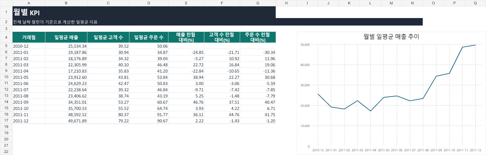
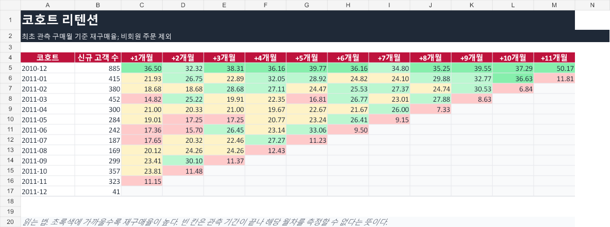

# 이커머스 성장성·리텐션·비회원 주문 분석

부트캠프에서 제공받은 영국 온라인 쇼핑몰 거래 데이터를 바탕으로, 서비스가 **얼마나 성장하고 있는지**, 고객이 **다시 구매하고 있는지**, 그리고 비회원 주문이 **어떤 기회로 이어질 수 있는지**를 분석한 포트폴리오 프로젝트입니다.

처음에는 월별 매출을 확인하는 수준의 과제였지만, 포트폴리오로 발전시키는 과정에서 단순 매출 합계보다 중요한 질문들이 보였습니다.

- 매출이 늘었다면, 고객 수와 주문 수도 함께 늘었을까?
- 신규 고객은 첫 구매 이후 계속 남아 있을까?
- 비회원 주문은 그냥 일회성 주문일까, 아니면 고액 고객을 확보할 기회일까?

이 질문에 답하기 위해 월별 KPI, 코호트 리텐션, 비회원 주문 지표를 다시 계산하고 한글 대시보드로 정리했습니다.

## 핵심 요약

| 분석 축 | 결론 |
|---|---|
| 성장성 | 2011년 하반기부터 일평균 매출, 고객 수, 주문 수가 함께 상승했고 11월과 12월 초에 피크가 나타났습니다. |
| 리텐션 | 대부분의 코호트는 첫 구매 후 1개월 차에 크게 이탈한 뒤 20~30%대에서 유지됩니다. |
| 비회원 주문 | 2011년 11월 비회원 주문 비중은 3.96%로 낮지만, 비회원 매출 비중은 21.65%로 높았습니다. |
| 실행 방향 | 4분기 사전 주문 캠페인, 고액 비회원 구매자의 회원화, 첫 구매 후 7/21/30일 재구매 유도 플로우를 제안했습니다. |

## 대시보드 미리보기







## 프로젝트 구조

```text
.
├─ data/
│  └─ raw/
│     └─ README.md
├─ docs/
│  ├─ project_guide.md
│  └─ github_upload_guide.md
├─ portfolio/
│  ├─ README.md
│  ├─ dashboard/
│  │  └─ 이커머스_성장_리텐션_대시보드.xlsx
│  ├─ data/
│  │  ├─ monthly_kpi.csv
│  │  ├─ cohort_retention_matrix.csv
│  │  ├─ guest_metrics.csv
│  │  └─ data_quality_steps.csv
│  ├─ previews/
│  ├─ scripts/
│  │  ├─ prepare_analysis_data.py
│  │  └─ build_dashboard.mjs
│  └─ sql/
│     └─ ecommerce_portfolio_analysis.sql
└─ README.md
```

## 데이터 공개 범위

원본 CSV는 부트캠프에서 제공받은 자료라 공개 레포에는 포함하지 않았습니다. 대신 분석을 재현할 수 있도록 원본 파일을 어디에 두어야 하는지 안내만 남겼습니다.

```text
data/raw/ecommerce_data.csv
```

레포에는 원본 거래 로그 대신, 분석 스크립트로 계산한 월별 KPI, 코호트 리텐션, 비회원 지표 등 파생 요약 데이터만 포함했습니다.

## 분석 과정

### 1. 데이터 정제 기준 통일

기존 산출물에서는 일부 파일의 이상치 제거 기준이 달라 2011년 1월 일평균 매출 값이 다르게 나타났습니다. 포트폴리오에서는 아래 기준을 모든 지표에 동일하게 적용했습니다.

| 전처리 기준 | 이유 |
|---|---|
| `InvoiceNo`가 `C`로 시작하는 거래 제거 | 취소 거래 제외 |
| `StockCode` 길이 5자 미만 제거 | 일반 상품이 아닌 특수 코드 제외 |
| `Quantity <= 0` 제거 | 반품 또는 비정상 수량 제외 |
| `UnitPrice <= 0` 제거 | 비정상 단가 제외 |
| `Quantity IN (80995, 74215)` 제거 | 월별 매출을 크게 왜곡하는 대량 이상치 제외 |

특히 `Quantity = 74215` 이상치를 제거하지 않으면 2011년 1월 일평균 매출은 `21,677.66`으로 계산됩니다. 제거 후 기준값은 `19,187.86`입니다.

### 2. 월별 KPI

월별 합계가 아니라 **일평균 매출, 일평균 고객 수, 일평균 주문 수**를 계산했습니다. 월별 날짜 수가 다르기 때문에 단순 월합보다 일평균이 비교에 더 적합하다고 판단했습니다.

2011년 9월 이후 지표가 빠르게 상승했고, 11월과 12월 초에 가장 높은 매출 구간이 나타났습니다.

### 3. 코호트 리텐션

회원 고객만 대상으로 최초 구매월을 기준으로 코호트를 만들고, 이후 몇 개월 뒤 다시 구매했는지 계산했습니다.

대부분의 코호트에서 +1개월 차 리텐션이 크게 하락했습니다. 이 패턴은 첫 구매 직후 30일 안에 고객을 다시 불러오는 캠페인이 중요하다는 의미로 해석했습니다.

### 4. 비회원 주문 분석

`CustomerID`가 없는 주문을 비회원 주문으로 정의했습니다.

2011년 11월에는 비회원 주문 비중이 낮았지만, 비회원 매출 비중과 비회원 주문당 평균 매출이 높았습니다. 그래서 이 구간은 단순한 비회원 유입이 아니라 고액 주문 고객 또는 B2B성 구매 기회로 해석했습니다.

## 주요 산출물

| 파일 | 설명 |
|---|---|
| [portfolio/README.md](portfolio/README.md) | 포트폴리오용 케이스 스터디 문서 |
| [docs/project_guide.md](docs/project_guide.md) | 프로젝트를 스스로 설명할 수 있도록 정리한 상세 해설 |
| [portfolio/dashboard/이커머스_성장_리텐션_대시보드.xlsx](portfolio/dashboard/이커머스_성장_리텐션_대시보드.xlsx) | 한글 대시보드 Excel |
| [portfolio/sql/ecommerce_portfolio_analysis.sql](portfolio/sql/ecommerce_portfolio_analysis.sql) | BigQuery 기준 SQL 정리본 |
| [portfolio/scripts/prepare_analysis_data.py](portfolio/scripts/prepare_analysis_data.py) | 원본 CSV에서 분석 지표를 재계산하는 Python 스크립트 |
| [portfolio/scripts/build_dashboard.mjs](portfolio/scripts/build_dashboard.mjs) | 대시보드 Excel 생성 스크립트 |

## 재현 방법

원본 CSV를 로컬에 배치합니다.

```text
data/raw/ecommerce_data.csv
```

Python 의존성을 설치합니다.

```powershell
pip install -r requirements.txt
```

분석 데이터를 다시 계산합니다.

```powershell
python portfolio/scripts/prepare_analysis_data.py
```

대시보드 Excel은 이미 산출물로 포함되어 있습니다. `portfolio/scripts/build_dashboard.mjs`는 Codex 번들 스프레드시트 런타임의 `@oai/artifact-tool`을 사용해 대시보드를 생성한 기록용 스크립트입니다.

## 배운 점

이 프로젝트를 하면서 가장 크게 배운 것은 **지표 정의가 곧 문제 정의**라는 점입니다.

처음에는 월별 매출만 보면 충분할 것 같았지만, 실제로는 집계 단위에 따라 결론이 달라졌습니다. 상품 라인 수를 세는지, 주문 수를 세는지, 고객 수를 세는지에 따라 서비스의 상태를 다르게 해석할 수 있었습니다.

또한 리텐션 분석에서는 숫자만 보는 것이 아니라 관측 기간도 함께 봐야 한다는 점을 배웠습니다. 데이터가 2010년 12월부터 시작되기 때문에 첫 코호트에는 실제 신규 고객이 아닌 기존 고객이 섞였을 수 있습니다. 이런 한계를 함께 설명해야 분석이 더 설득력 있다고 느꼈습니다.

마지막으로, 비회원 주문을 보면서 “회원가입률이 낮다”라는 단순 결론보다 “고액 비회원 구매자를 어떻게 장기 고객으로 전환할 것인가”라는 실행 질문으로 이어지는 분석이 더 실무적이라는 점을 배웠습니다.

## 한계와 다음 단계

이 분석은 거래 로그만 기반으로 합니다. 유입 채널, 캠페인 정보, 상품 카테고리, 회원가입 시점은 확인할 수 없습니다. 그래서 11월 피크가 정확히 어떤 캠페인이나 상품군 때문인지는 추가 데이터 없이는 확정할 수 없습니다.

다음 단계로는 아래 분석을 추가해보고 싶습니다.

- 11월 매출 피크에 기여한 상위 SKU 분석
- 비회원 고액 주문의 국가와 상품 구성 분석
- 첫 구매 후 재구매 고객과 이탈 고객의 상품 차이 비교
- Tableau, Looker Studio, Power BI 중 하나로 대시보드 확장

